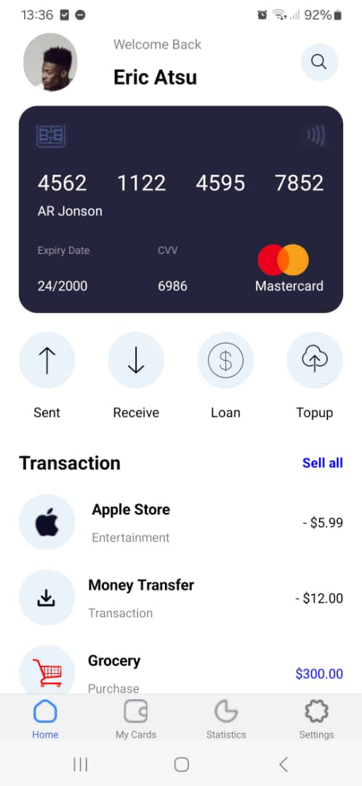
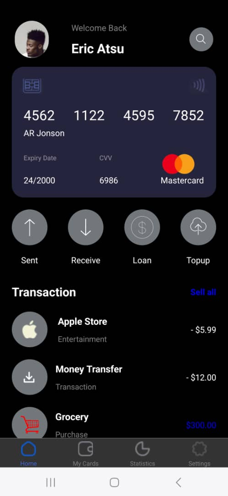
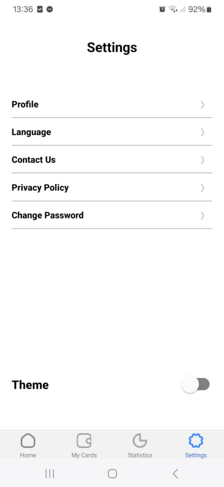
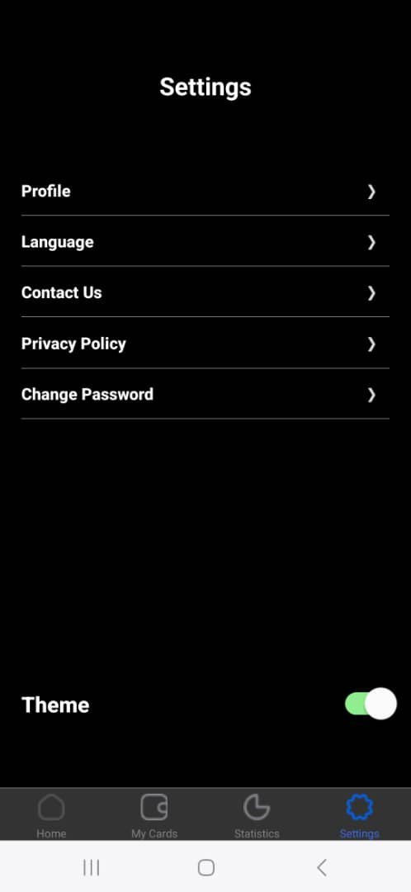

# rn-assignment5-11252675

## Description

### Settings Page

- SettingsMenu

  - This component provides a menu for various settings options in the application. It receives the current theme mode as a prop, which it may use to style the menu items appropriately.

- ThemeToggler

  - This component allows the user to toggle the theme of the application between 'dark' and 'light' modes. It receives the current theme mode and a toggleTheme function as props, which it likely uses to update the theme.

### Home Page

- WelcomeSection

  - This component displays a welcome message to the user. It receives the current theme mode as a prop, which it may use to style the message appropriately.

- MasterCard

  - This component displays a master card, . It receives the current theme mode as a prop, which it may use to style the card accordingly.

- ActionButtonSection

  - This component renders a section with various action buttons, such as buttons for transferring funds, making payments, or accessing other features of the application. It receives the current theme mode as a prop, which it may use to style the buttons appropriately.

- TransactionSection
  - This component displays a section with information about the user's recent transactions. It receives the current theme mode as a prop, which it may use to style the transaction entries appropriately.

### Other Components

- MyCards

  - Just a placeholder for the cards page

- Statistics

  - Also a placeholder for the statistics page

- ThemeHandler
  - Handles theme changing logic.

## Screenshots

### Home Page

### Settings

